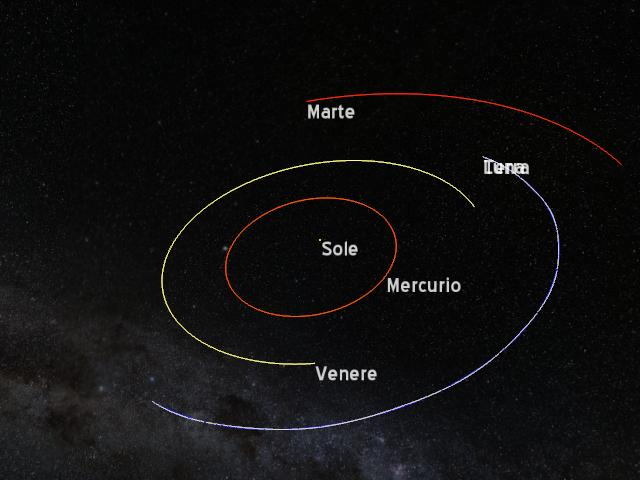
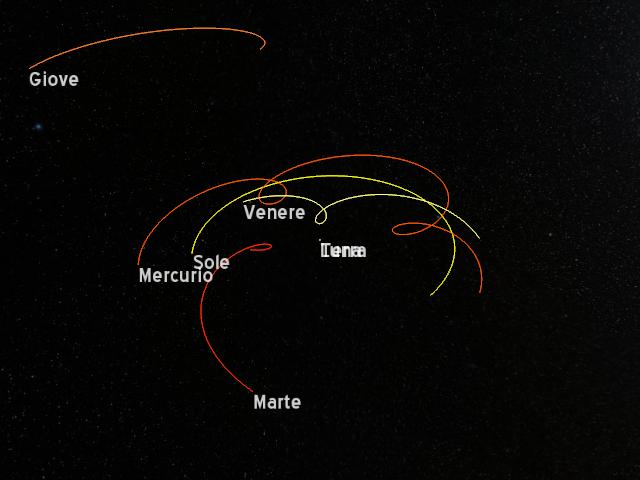
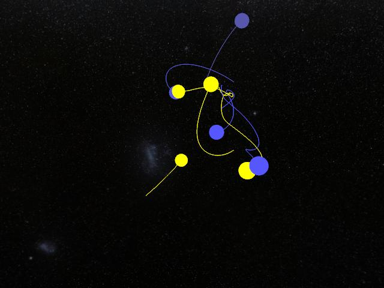

Newton
======

Questo programma è una simulazione interattiva che mostra la traiettoria di corpi sotto l'azione della forza di attrazione gravitazionale reciproca. Prendendo in input posizione, massa e velocità ne simula gli spostamenti.

L'avevo preparato nel 2010 come tesina per la maturità al liceo scientifico. Di recente ho solo controllato che compilasse con Ogre 1.9 sotto Ubuntu 14.04, ma ho lasciato la qualità del codice che era. Di sicuro non è privo di bachi.

Screenshot
----------

#### Sistema solare

#### Sistema solare, riferimento geocentrico

#### Sistema complesso

Installazione e utilizzo su Ubuntu/Debian
-----------------------------------------

### Installazione delle liberie

- Ogre 1.9 (libogre)
- JsonCpp (libjsoncpp)
- OIS (libois)

Su Ubuntu 14.04

	sudo apt-get install libjsoncpp-dev libois-dev libogre-1.9-dev

### Compilazione

	make && make install

### Esecuzione del programma

	./newton-gui scripts/ssol-attuale.conf

Comandi
-------

### Comandi generali

- tasto `esc`: chiudi il programma
- tasto `p`: ferma/riprendi la simulazione
- tasto `n`: visualizza/nascondi i nomi dei pianeti
- tasto `r`: riporta i pianeti nella situazione originaria
- tasto `t`: visualizza/nascondi il tracciato dei pianeti

### Movimento nello spazio

- tasto sinistro del mouse + movimento:
Ruota la telecamera attorno al pianeta su cui è ancorata.

- tasto destro del mouse + movimento:
Con un movimento verticale si inclina la telecamera di lato.
Con un calibrato movimento diretto verso il basso e a sinistra è possibile
ruotare la telecamera attorno all'asse verticale (relativo alla visuale) che
passa per pianeta su cui è ancorata

- rotella del mouse: muove la telecamera avanti/indietro

### Parametri della visualizzazione

- tasto `1` e `2`: cambia il pianeta su cui è ancorata la telecamera
- tasto `3` e `4`: cambia il pianeta rispetto a cui è relativo il tracciato del
pianeta a cui è ancorata la telecamera

### Informazioni aggiuntive o di debug

- tasto `i`: visualizza le informazioni di debug (tempo trascorso, step per frame, pianeta ancora, tracciato relativo a..)

- tasto `o`: visualizza il numero effettivo di frame per secondo e il logo di Ogre

- tasto `m`: visualizza in modo ciclico solo le facce (default), gli spigoli
(wireframe) o i vertici (nuvola di punti) dei volumi rappresentati

- tasto `c`: stampa su stdout (nel terminale) le coordinate attuali della telecamera
rispetto al pianeta su cui è ancorata

Utilizzo di newton-calc
-----------------------

Per accelerare la simulazone fisica è possibile rinunciare alla visualizzazione grafica, utilizzando il programma newton-calc.
Analogamente a newton-gui, è richiesto come primo parametro il file di configurazione, seguito dalla durata in secondi della simulazione e dal percorso
del file su cui deve essere salvata la configurazione finale.

es: calcola la configurazione dei pianeti dopo un'ora (3600 secondi)

	./newton-calc scripts/ssol-attuale.conf 3600 scripts/ssol-finale.conf

Strumenti aggiuntivi
--------------------

In `tools/` ci sono alcuni programmi che sono stati utili allo sviluppo del programma.

`spherical2skybox` permette di convertire un'immagine rappresentate la superficie
di una sfera nelle sei immagini di cui è composto il cubo del plugin skybox di Ogre.

`get_conf.sh` e `get_planet_data.sh` sono due script bash eseguibili sotto linux che aiutano a costruire una configurazione scaricando le coordinate dei pianeti dal servizio pubblico Horizons della NASA.

Fonti
-----

La texture della Via Lattea è una rielaborazione di [ESO - Milky Way](https://commons.wikimedia.org/wiki/File:ESO_-_Milky_Way.jpg). Si veda il link per informazioni sulla licenza.

I file in `media/`, ad eccezione di quelli riguardanti la Via Lattea, sono forniti assieme al codice sorgente di [Ogre](www.ogre3d.org). Si veda sotto per la licenza.

I file in `src/ogre/`, sono forniti assieme al codice sorgente di [Ogre](www.ogre3d.org). Si veda sotto per la licenza.

I dati sui pianeti e satelliti del sistema solare (posizione, velocità, ecc) provengono dal JPL HORIZONS System della NASA: http://ssd.jpl.nasa.gov/?horizons

Il codice del programma Newton è rilasciato sotto la licenza [GNU GNU General Public License, versione 3](./LICENSE). Copyright (C) 2010-2015 Federico Poli <federpoli@gmail.com>.

#### Ogre

OGRE (www.ogre3d.org) is made available under the MIT License.

Copyright (c) 2000-2015 Torus Knot Software Ltd

Permission is hereby granted, free of charge, to any person obtaining a copy
of this software and associated documentation files (the "Software"), to deal
in the Software without restriction, including without limitation the rights
to use, copy, modify, merge, publish, distribute, sublicense, and/or sell
copies of the Software, and to permit persons to whom the Software is
furnished to do so, subject to the following conditions:

The above copyright notice and this permission notice shall be included in
all copies or substantial portions of the Software.

THE SOFTWARE IS PROVIDED "AS IS", WITHOUT WARRANTY OF ANY KIND, EXPRESS OR
IMPLIED, INCLUDING BUT NOT LIMITED TO THE WARRANTIES OF MERCHANTABILITY,
FITNESS FOR A PARTICULAR PURPOSE AND NONINFRINGEMENT. IN NO EVENT SHALL THE
AUTHORS OR COPYRIGHT HOLDERS BE LIABLE FOR ANY CLAIM, DAMAGES OR OTHER
LIABILITY, WHETHER IN AN ACTION OF CONTRACT, TORT OR OTHERWISE, ARISING FROM,
OUT OF OR IN CONNECTION WITH THE SOFTWARE OR THE USE OR OTHER DEALINGS IN
THE SOFTWARE.
